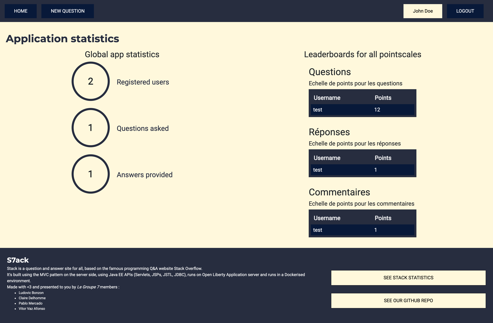
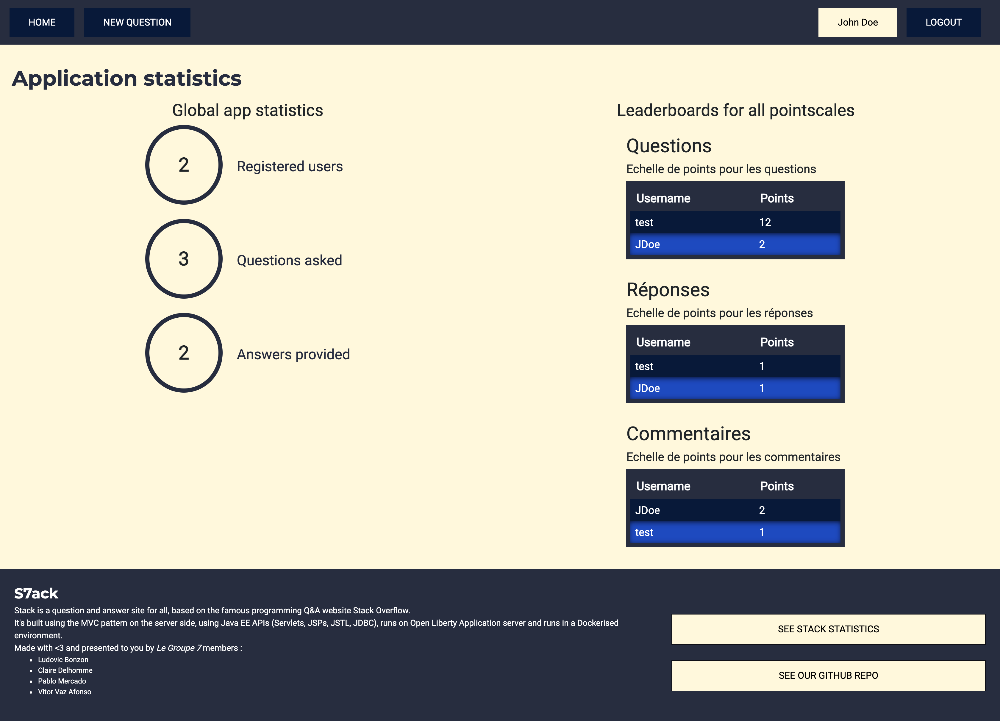
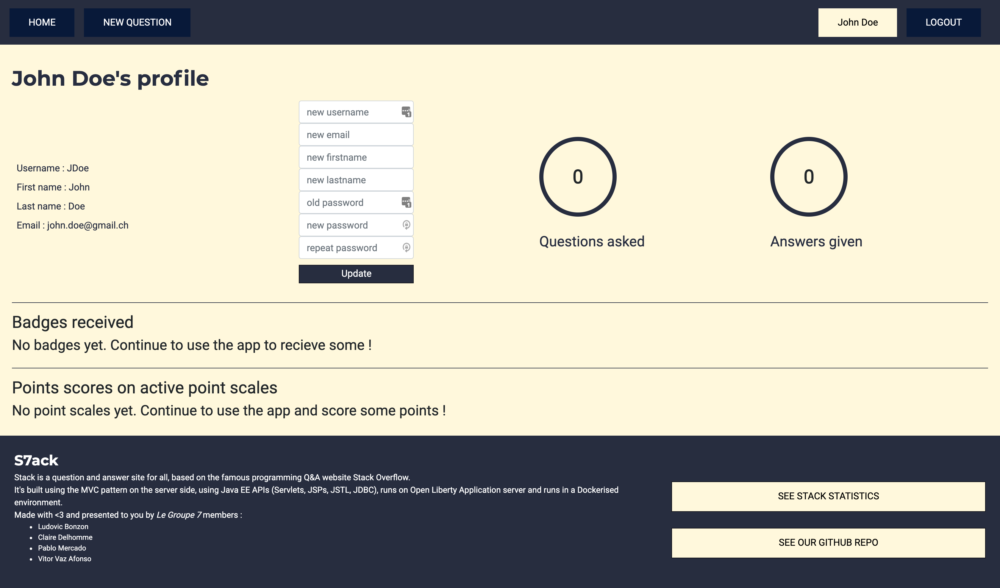
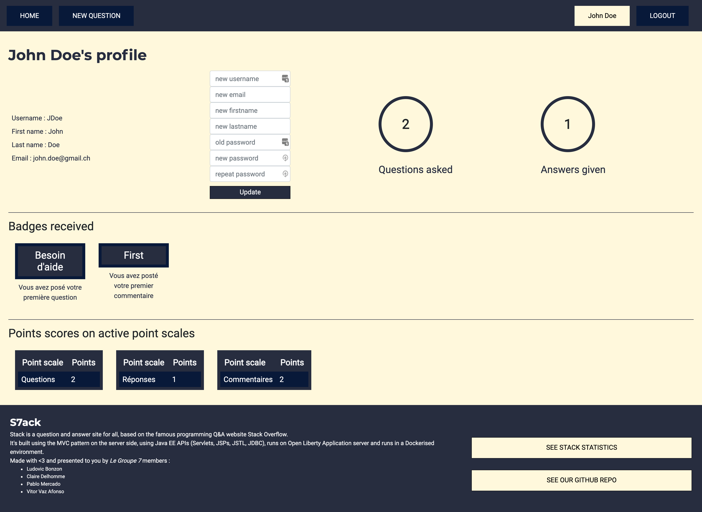

# S7ack - Gamification API

*Etudiants : Bonzon Ludovic, Delhomme Claire, Mercado Pablo & Vaz Afonso Vitor*

*Le Groupe 7* a développé une API REST pour vous aider à gamifier votre application. Voici comment vous pouvez créer
votre propre application gamifiée

## Utiliser le moteur de gamification pour votre application

Nous fournissons différents endpoints pour vous aider à gamifier votre application comme vous le souhaitez :

* badges
* point scales
* leaderboards
* rules

Lorsque l'application est en cours d'utilisation, vous pouvez mettre à jour la gamification engine selon les
interactions de vos utilisateurs en postant des requêtes vers l'endpoint

* events

Vous pouvez obtenir des informations à propos des utilisateurs en accédants aux différents endpoints commencant par
*users

De plus amples informations sont disponibles [>ici<](http://localhost:8080/v3/api-docs)

## Choix d'implémentation

Utilisation d'une base de données MySQL dans les 2 projets

...

### Lien entre serveur S7ack et serveur de gamification

// INSERT DIAGRAMME DE CLASSES HERE ???

### Paliers et attribution points et badges au travers des règles

// TODO : Vitor

## Tests

// TODO : Claire

### Ce qui a été testé

### Comment

## État du projet

Le projet est dans un état stable et fonctionnel. Des tests permettent d'évaluer le fonctionnement des différents
composants, comme indiqué au point précédent.

### Ce qui fonctionne

Tous les endpoints tels que définis dans [la documentation d'API](http://localhost:8080/v3/api-docs) sont fonctionnels.

La page de statistiques a été agrémentée de la présence de toutes les leaderboards relatifs à une point scale présents
dans notre application

|Etat au démarrage de l'application|Etat après une utilisation avec la gamification API|
|---|---|
|||

La page de profil d'un utilisateur contient désormais en plus des statistiques globales sur le nombre de quesions posées
et de réponses données, une section comportant tous les badges reçus suite aux actions effectuées sur le site et une
section comportant le score dans chaque point scale où l'utilisateur possède des points.

|Etat au démarrage de l'application|Etat après une utilisation avec la gamification API   |
|---|---|
|||

### Ce qui ne fonctionne pas

- Nous n'avons pas implémenté de système de pagination pour les ressources obtenues au travers de l'API

## Procédure d'exécution avec S7ack en local

### Données "démo" via scripts SQL

Nous tenons à signaler que des scripts d'insertion de données "démo" sont présents et activés dans nos 2 projets par
défaut. Ils prennent la forme de 2 scripts SQL de création base de données et d'insertions de données. Les scripts sont
présents pour les 2 projets dans `docker/init/db` et sont copiés dans les fichiers `docker-compose` au moyen du
paramètre suivant :

```dockerfile
# in file: docker-compose.yml
volumes:
        - ./docker/init/db:/docker-entrypoint-initdb.d
```

Vous pouvez donc aisément désactiver ce paramètre pour ne pas insérer de données de démo.

### Procédure locale

Concernant la procédure de démarrage des 2 applications, il faut simplement se rendre dans les dossiers `scripts/` de
chaque projet, et lancer dans cet ordre :

Pour le projet_2 (**Gamification API**) : `./runREST_API.sh`

Pour le projet_1 (**S7ack**) : `./startDocker.sh`

Une fois les scripts exécutés, patienter quelques instants pour s'assurer que tous les composants ont bien été démarrés.

Puis se rendre sur [http://localhost:9080/stack/questions](http://localhost:9080/stack/questions) et profiter de
l'application et de ses capacités de gamification !

### Si vous n'utilisez pas les scripts d'insertion de données de démo

#### API-Key dans `.env`

Pour effectuer des requêtes vers l'API, il est nécessaire d'avoir enregistré l'application au moteur de gamification au
moyen d'une requête `POST /applications` en fournissant un nom et une description de votre application. Ceci vous
retournera une clé d'API unique qu'il sera nécessaire de placer dans le fichier contenant les variables
d'environnement (pour S7ack c'est dans : `src/main/liberty/config/server.env`).

#### Création manuelle de données

Il faut penser à créer manuellement (via des requêtes curl ou via l'interface web swagger) des règles, point scales et
badges, sinon tous les évènements créés à partir d'interaction avec S7ack n'auront aucun impact sur le côté gamifié de
notre application.

# Gamification engine

### Build & run le gamification engine

```bash
cd scripts
sh runREST_API.sh
```

### Run la version *latest* du gamification engine

Pour utiliser l'image sur le github container registry de l'organisation *AMT-Project*:

```bash
cd scripts
sh pullREST_API.sh
```
**Note**: Le nom du network généré ne permet pas l'intégration de stack avec le gamification engine s'il est lancé de cette façon.

### Test REST-API
Une fois le gamification engine lancé (via `runREST_API.sh` ou `sh pullREST_API.sh`):

```bash
cd gamification-specs
mvn clean test
```

## Problèmes rencontrés

- Règles difficiles à mettre en place (pour prendre en compte les concepts de point scales, de badges et de paliers),
  notamment en ce qui concerne le lien avec les évènements internes (lorsqu'un palier est franchi à la réception d'un
  évènement, il faut pouvoir renvoyer un évènement pour traiter par exemple l'attribution d'un badge)
- Intégration du gamification engine avec les requêtes http vers un localhost inaccessible depuis un container
